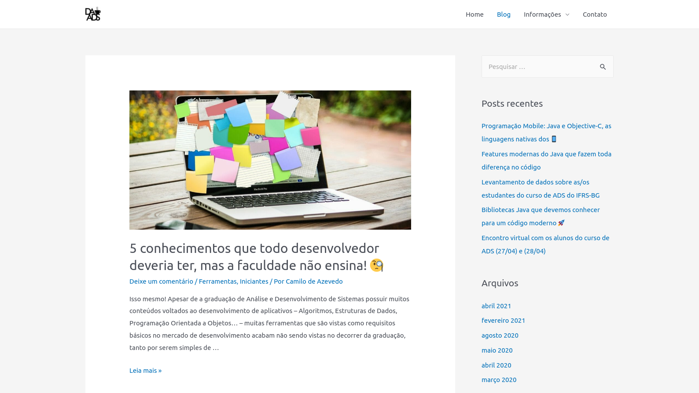

# Arquivo dos posts do Blog do Diretório Acadêmico de Análise e Desenvolvimento de Sistemas (DAADS) do IFRS

Anteriormente: [https://daads.com.br/site/blog/](https://daads.com.br/site/blog/)

O Blog do DAADS esteve online no endereço [https://daads.com.br/site/](https://daads.com.br/site/) de 2019 a 2021. Este repositório é dedicado a ser um backup dos posts que fiz durante esse período. Os posts são ou tem relação em maioria com `Java` justamente porque era a principal linguagem utilizada no Curso de Análise e Desenvolvimento de Sistemas (ADS) do Instituto Federal do Rio Grande do Sul (IFRS) durante o período.

| Título | Data | Assunto |
| :--    |  :--: | :--:    |
| [5 conhecimentos que todo desenvolvedor deveria ter, mas a faculdade não ensina! 🧐](https://github.com/Camilotk/posts-daads/blob/main/mas-a-faculdade-nao-ensina.md) | Wed, 11 Mar 2020 15:30 | `Conhecimentos Gerais` |
| [Ferramentas que todo programador Java deveria conhecer! 🛠️](https://github.com/Camilotk/posts-daads/blob/main/ferramentas-programador-java.md) | Mon, 20 Apr 2020 21:30 | `Java` |
| [Bibliotecas Java que devemos conhecer para um código moderno 🚀](https://github.com/Camilotk/posts-daads/blob/main/bibliotecas-java-moderno.md) | Mon, 04 May 2020 21:30 | `Java` |
| [Features modernas do Java que fazem toda diferença no código ☕](https://github.com/Camilotk/posts-daads/blob/main/features-modernas-do-java.md) | Mon, 22 Feb 2021 14:30 | `Java` |
| [Programação Mobile: Java e Objective-C, as linguagens nativas dos 📱](https://github.com/Camilotk/posts-daads/blob/main/mobile-java-objective-c.md) | Thu, 15 Apr 2021 15:50 | `Mobile` |

