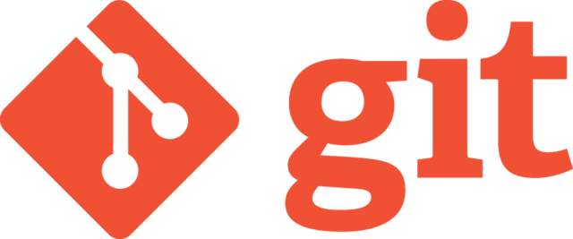
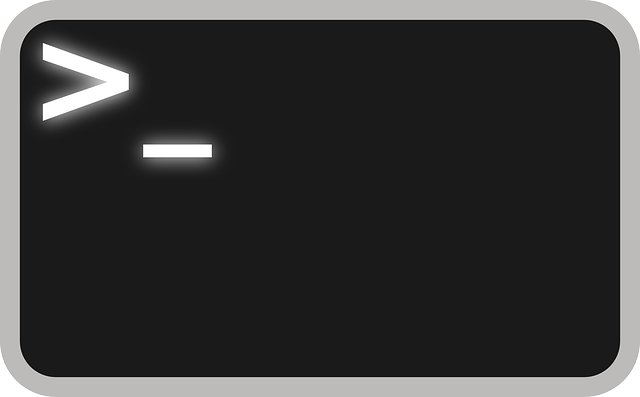

<!--
---
title: '5 conhecimentos que todo desenvolvedor deveria ter, mas a faculdade não ensina! 🧐'
date: Wed, 11 Mar 2020 15:30:00 +0000
draft: false
tags: ['Bash', 'DevDocs', 'Docker', 'Documentação', 'Ferramentas', 'Git', 'GitHub', 'GitKraken', 'Inglês', 'Iniciantes', 'Kanban', 'Notion', 'Terminal', 'Trello', 'Virtualização', 'zsh']
---
-->

<p align="center">
  <a href="#" target="_blank">
    
  </a>
</p>

# 5 conhecimentos que todo desenvolvedor deveria ter, mas a faculdade não ensina! 🧐

Isso mesmo! Apesar de a graduação de Análise e Desenvolvimento de Sistemas possuir muitos conteúdos voltados ao desenvolvimento de aplicativos - Algoritmos, Estruturas de Dados, Programação Orientada a Objetos... - muitas ferramentas que são vistas como requisitos básicos no mercado de desenvolvimento acabam não sendo vistas no decorrer da graduação, tanto por serem simples de aprender quanto por não haver tempo hábil no curso para ensinar conteúdos que não são vistos como essenciais, em contrapartida da atual formatação e estrutura em que o currículo foi construído. Fique calmo! Nesse post não vamos apenas falar sobre alguns desses conhecimentos, mas vamos também linkar uma série de vídeo e tutoriais sobre cada uma e no final também vamos divulgar alguns cursos que abordam de forma estruturada e organizada em um currículo pensado nos itens mais complexos. Recomendamos a todos que ainda não conhecem um ou outro desses itens que pesquise um pouco mais sobre ele e a quem não conhecer vários que considere os links abaixo para que possa aprender isso e muito mais e possa também estar atualizado com o que o mercado espera.

### #1 - Inglês

 

Apesar de não ser uma ferramenta de programação em si, é o conhecimento mais importante que o desenvolvedor pode ter para dominar a ferramenta mais importante: a documentação. A maioria das documentações das linguagens de programação, livros, comunidades e conteúdos sobre desenvolvimento estão ou inicialmente estavam em Inglês. Nesse último ponto é importante também lembrar que boas traduções para português no mercado editorial envolvem muito mais que uma simples tradução - envolvem revisores, diagramadores, designers… - o que faz muitas vezes com que o tempo de publicação de um novo material em português seja longo, muitas vezes o conteúdo acaba desatualizado quando a publicação está finalmente pronta para o mercado e já existe um novo material mais atualizado disponível… em Inglês. Além disso, não somente os comandos de programação são escritos em Inglês, mas também as mensagens e erros das linguagens estão em idioma estrangeiro. 

- **Sugestão de Vídeo**: [Como aprendi Inglês - Fábio Akita - Akitando](https://www.youtube.com/watch?v=OkboNGQ9LU0)

###### #1.1 Documentação das Linguagens e Frameworks

Essa é uma ferramenta essencial e indispensável à qualquer desenvolvedor em qualquer fase da carreira. A documentação não apenas ensina o uso da linguagem como também traz exemplos e orientações sobre como desenvolver utilizando a linguagem ou framework de trabalho. Hoje no curso trabalhamos com quatro principais linguagens: [Java](https://docs.oracle.com/en/java/javase/11/), [PHP](https://www.php.net/manual/en/), [Javascript](https://developer.mozilla.org/en-US/docs/Web/JavaScript) e [Python](https://docs.python.org/3/) e com cinco frameworks de desenvolvimento: [Spring Boot](https://docs.spring.io/spring-boot/docs/current/reference/htmlsingle/), [Laravel](https://laravel.com/docs/6.x), [Tensorflow](https://www.tensorflow.org/api_docs/python), [Ionic](https://ionicframework.com/docs) e [Express](https://expressjs.com/en/api.html). O link para a documentação de todas essas linguagens e frameworks estará no link de cada uma. E note-se que apesar de haver versões em português com um tempo mais rápido de tradução que livros, as documentações também possuem um tempo de tradução no lançamento de novas versões por isso é recomendado seu uso em Inglês.

###### #1.2 DevDocs

Essa é uma ferramenta que não é tão conhecida e nem tão essencial, porém facilita e muito a consulta a documentação - Em Inglês - de diversas linguagens de programação, permitindo inclusive a busca textual por mensagens de erro, features ou comandos em todas as documentações instaladas. O DevDocs pode ser utilizado na versão web através deste [link](https://devdocs.io/), ou baixado como aplicativo gratuito para MAC, Linux e Windows través [deste](https://devdocs.egoist.moe/). Para quem utiliza MAC também há o [Dash](https://kapeli.com/dash) que é um aplicativo pago com a mesma funcionalidade, porém integrado ao sistema permitindo que o desenvolvedor use os atalhos de pesquisa para pesquisar nas documentações.

### #2 Kanban

 

A **gestão de tarefas** é uma das partes de ferramentas de **gestão de projetos** - que envolve mais do que tarefas -, porém praticamente todas as metodologias modernas de **gestão de projetos** utilizam o Kanban como ferramenta de **gestão de tarefas**.  Temos alguns conteúdos como gestão de projetos que dão um _overview_ sobre a ferramenta, porém dificilmente ela recebe a atenção necessária para que de fato entendamos sua importância e utilização. O Kanban não só divide as tarefas por fase de desenvolvimento como também ajuda o projeto a crescer de forma planejada com cada equipe ou desenvolvedor se concentrando em pequenas tarefas que compõe o todo e orquestram o resultado final de forma organizada. Na prática, todas as idéias de novas features são colocados em um quadro "Idéia", quando essa tarefa precisa ser feita ela passa para "A fazer" e então quando ela é atribuída a um Desenvolvedor que irá trabalhar nela ela vai para "Fazendo" e o nome de quem está desenvolvendo é marcado na tarefa, quando a tarefa é entregue ela passa para "Feito". Assim permitindo a visibilidade de cada tarefa, seu progresso e o que cada desenvolvedor está trabalhando ou fez.

###### #2.1 Trello

O Trello é uma ferramenta para a criação e gerenciamento de quadros Kanban on-line. Ele permite a gestão de equipes, projetos e quadros, além de permitir a integração com diversos outros serviços como o Slack, a nuvem do Google - Docs, Drive, Agenda... - e diversas outras ferramentas. O Trello apesar de simples possui opções avançadas como a organização de tarefas em pastas após concluídas, gerenciamento de permissões para cada membro da equipe e até mesmo transformar quadros em calendário e linkar um com o outro para diferentes visualizações das tarefas do projeto. Hoje grande parte das pequenas empresas e startups de tecnologia utilizam o Trello na gestão de tarefas, tanto por ser gratuito para pequenas equipes/indivíduos quanto bem estabelecido no mercado. 

- **Sugestão de curso**: [Trello: do B-A-BA ao avançado - O curso mais completo de Trello](https://hotm.art/QueroAprenderTrelloAvancado)

###### #2.2 Notion

Novamente uma ferramenta opcional e pouco conhecida que é bem bacana é o [Notion](http://notion.so). Ele é um aplicativo que tenta centralizar a função de diversas ferramentas, entre elas o Trello. Ele permite criar notas e lembretes como Evernote, documentações de projetos pessoais como o GitHub Wiki, quadros kanban como o Trello e planilhas como o Office 360 ou Google Sheets tudo integrado em uma interface muito consistente e fácil de usar, tornando-se uma ferramenta excelente para tarefas desde tomar notas em uma aula ou palestra até gerenciar projetos complexos em grandes equipes. Ele permite organizar tudo em Workspaces - como pastas - e compartilhar facilmente o conteúdo com outras contas do Notion. Ele pode ser tanto usado na versão Web através do site oficial, quanto instalado como aplicativo para Windows, Mac, iOS e Android. Para Linux existe um aplicativo não oficial chamado de [Lotion](https://github.com/puneetsl/lotion) que oferece a mesma interface web.

### #3 Git

 

O git é a ferramenta de controle de versões dominante no mercado. Seu uso é tão importante que hoje é requisito na maioria das vagas de desenvolvimento em qualquer nível de conhecimento. Essencial no desenvolvimento de projetos em equipe e muito importante para que possamos ter o controle das alterações que fazemos no nosso código. E o que esse negócio de controle de versões significa? Significa que a ferramenta salva todo o histórico de alterações do projeto desde o início que cada desenvolvedor fez no código fonte, permitindo voltar o código a qualquer momento desde sua publicação, visualizar diferenças entre o código existente e o que está sendo enviado, integrar código de diferentes desenvolvedores - inclusive remotos - ao projeto e gerenciar o que foi feito em cada mudança do _software_. Além do git algumas empresas usam outras ferramentas de controle de versões como [CVS](https://www.nongnu.org/cvs/) ou [Mercurial](https://www.mercurial-scm.org/), porém mesmo com comandos diferentes os princípios de uso serão os mesmos. 

- **Para saber mais sobre git**: [Entendendo git (não é um tutorial) - Fábio Akita - Akitando](https://www.youtube.com/watch?v=6Czd1Yetaac)

###### #3.1 GitHub, BitBucket ou GitLab

Não confunda **git** com **GitHub**, apesar de compartilharem um nome parecido são ferramentas diferentes. O [GitHub](https://github.com/) é uma plataforma de hospedagem de código-fonte com controle de versão atualmente pertecente à Microsoft. Traduz pra mim? Claro, o GitHub é uma plataforma web onde você pode fazer o upload de seu projeto git - ou CVS, ou Mercurial - para a nuvem permitindo que ele esteja disponível para que qualquer pessoa com conexão com a internet possa baixar o código-fonte fazer alterações e enviá-las usando gerenciamento de versões. Isso significa que todos os desenvolvedores sempre terão a mesma última versão disponível do código a partir do GitHub permitindo sincronicidade e agilidade no desenvolvimento utilizando controle de versões. Um concorrente muito popular é o [BitBucket](https://bitbucket.org/) da Atlassian - mesma empresa que faz o Trello - e que tem a [melhor documentação](https://www.atlassian.com/git/tutorials) da atualidade de git, ambos GitHub e BitBucket são completamente gratuitos com funções premium vendidas em planos. Também há o GitLab que é uma alternativa Open Source a ambos. 

- **Para aprender mais sobre  git e GitLab**:  [Curso de git, GitLab, Docker, ansible e AWS](https://hotm.art/cursoGitDocker)

###### #3.2 Sourcetree ou GitKraken

O controle de versão normalmente é feito por terminal, porém existem ferramentas gráficas que gerenciam e facilitam o desenvolvimento utilizando controle de versão. Para Windows ou MAC existe o [Sourcetree](https://www.sourcetreeapp.com/) - de novo, da Atlassian - que é completamente gratuito e o seu principal concorrente é o programa pago [GitKraken](https://www.gitkraken.com/) que tem versão para Windows, MAC e Linux. Ambas ferramentas foram desenvolvidas para facilitar e agilizar o uso de git seguindo os mais elevados princípios de UI/UX e que podem facilitar em muito o uso de controle de versões para quem está começando.

### #4 Terminal

 

Não importa o sistema operacional que você use você vai ter que cedo - ou tarde - aprender a utilizar o terminal. É impossível fugir uma vez em que os servidores onde vamos fazer o _deploy_ do código é operado por terminal, além de ser a melhor forma de automatizar tarefas e escrever scripts que interagem com o Sistema Operacional e dão "poderes" para que o programador possa utilizar seu conhecimento de programação para fazer operações muito além do que um usuário comum consegue fazer. Imagine a seguinte situação: você quer mover todos os arquivos - inclusive dentro de pastas - que comecem com a letra 'b'/'B' da sua pasta de downloads. Para isso você teria que clicar no explorer ou gerenciador de arquivos, ir até à pasta de downloads, checar cada arquivo selecionar os arquivos que começam com 'b'/'B' move-los e voltar para repetir o processo em cada pasta. Mas isso pode ser feito simplesmente por esse comando Bash:

```bash
$ cp -R /home/user/Downloads/[bB]* ~/localdacopia
```

Cada sistema operacional possui um terminal diferente com comandos próprios - que são linguagens de programação próprias -, o Linux usa o Bash, o MAC o zsh e o Windows o Powershell. Qualquer uma dessas linguagens pode ser instalado em qualquer um dos três sistemas operacionais, sendo o Bash o mais popular tanto por vir por padrão no Linux que é o Sistema Operacional mais utilizado em servidores quanto por ser o mais antigo e difundida das três opções. Como recomendação pessoal, aprenda o shell do sistema que você usa, ou seja:

###### #4.1 Powershell

O Powershell é o mais novo, moderno e menos usado/conhecido dentre as três opções. Ele vem nativamente instalado em qualquer computador com Windows a partir da versão 7 do Sistema Operacional, para usá-lo basta apertar a tecla windows e digitar 'Powershell' e então apertar Enter. Seus grandes diferenciais são a grande integração que possui com os produtos da Microsoft - Excel, Windows, .NET... -, além de ser a única linguagem shell orientada a objetos das três. Apesar de ser pouco comum de usá-la em servidores, ela pode ser instalada no Linux caso o desenvolvedor deseje usá-la em um servidor linux e vem como ferramenta padrão do Windows Server caso essa seja a opção de desenvolvimento. 

- **Para aprender Powershell**: [Powershell para DBAs - Rodrigo Crespi - SQLCrespi](https://www.youtube.com/watch?v=k85RAvp0juU&list=PLVbH9e_ughdyZULo3FoCbtFe702qF_5fl) 
- **Cheatsheet** (_resumo dos comandos, em Inglês_): [Cheatsheet ](https://cdn.comparitech.com/wp-content/uploads/2018/08/Comparitech-Powershell-cheatsheet.pdf)

###### #4.2 Bash

O Bash é a ferramenta mais utilizada e requisitada do mercado. Isso é devido à ser a ferramenta mais antiga e consolidada entre todas as opções, além do fato de Linux ser a opção mais popular em servidores e embarcados onde esse conhecimento é crucial. Além dos comandos básicos que todo usuário precisa como cp - copy -, mv - move - ou  cd - change directory -, o Bash permite usar funções avançadas na manipulação de arquivos ou scripting tal como wildcards, brace expantion, regexes e dialogs ficou curioso para saber o que são essas funções? Considere fazer o curso de Shell abaixo com a lenda brasileira do Shell, o Julio Cezar, mas em resumo essas funções permitem respectivamente manipular arquivos usando strings coringa, criar listas utilizando grupos de strings, manipular arquivos ou valores utilizando regras específicas e construir uma interface gráfica dentro do terminal. 

- **Para aprender Bash com a lenda**: [Curso de Shell com Julio Cezar (Papai do Shell)](https://hotm.art/bash) 
- **Ou uma opção mais em conta**: [Linux 4Fasters - Shell do Básico ao avançado](https://www.udemy.com/course/shell-script-do-basico-ao-profissional/?referralCode=C8E1101FEF35452DB7BD) 
**Cheatsheet** (_resumo dos comandos, em Inglês_):  [Cheatsheet](https://cheatography.com/gregcheater/cheat-sheets/bash/)

###### #4.3 zsh

Além do Linux o MAC também tinha o Bash como padrão até 2019 quando ele foi substituído pelo zsh. Ambos Bash e zsh são tão similares que [um programador](https://unix.stackexchange.com/a/38173) trocou uma pela outra e jamais notou qualquer diferença mesmo após 6 anos de uso. Seu principal diferencial não está na sintaxe, mas nas possibilidades de customização e instalação de plugins. Apesar de ser menos popular que o Bash não é incomum ver servidores linux que possuem linha de comando zsh, uma vez em que ele é escrito em Bash e pode ser facilmente instalado em qualquer servidor. (Eu pessoalmente uso zsh no Linux) Se você deseja aprender zsh a recomendação é que instale ele conforme o post a seguir e faça o curso de Bash acima, uma vez que a sintaxe é similar. 

- **Para instalar e configurar o zsh da hora em seu OS**: [Terminal com Oh My Zsh, Spaceship, Dracula e mais - Rocketseat - Diego Fernandes](https://blog.rocketseat.com.br/terminal-com-oh-my-zsh-spaceship-dracula-e-mais/amp/)

### #5 Virtualização

 

Apesar de esta ser uma ferramenta que dificilmente é cobrada de um iniciante em programação é uma exigência para qualquer desenvolvedor pleno tanto quanto git e apesar de dificilmente ser cobrada de um iniciante ela é bastante simples e intuitiva de aprender, além de resolver um monte de problemas de desenvolvimento, desde incompatibilidade entre diferentes máquinas até a separação das dependências entre diferentes projetos e é essencial em ambientes modernos de produção. Apesar de existirem muitas ferramentas que são capazes de criar um ambiente virtualizado as ferramentas mais utilizadas são o Docker e o Vagrant. O que essas ferramentas essencialmente fazem é emular um sistema operacional sem interface gráfica dentro do terminal do seu sistema operacional - literalmente um OS separado para o ambiente de programação com seus próprios programas e processos - sem ter o peso de uma interface gráfica ou pacotes que não são necessários para esse ambiente sendo uma emulação muito leve de um OS separado para cada projeto e o mais bacana é que esse OS além de não misturar as instalações e processos do projeto com seu computador também pode ser compartilhado com todos os desenvolvedores fazendo com que todos "desenvolvam na mesma máquina".

###### #5.1 Docker

O [Docker](https://www.docker.com/) é a ferramenta mais popular de virtualização e conteinerização de ambientes. Seu principal diferencial está no [dockerhub](https://hub.docker.com/) que é como um GitHub para imagens de OS e também uma excelente [interface gráfica](https://www.docker.com/products/docker-desktop) para Windows e MAC. Além de todas essas facilidades o Docker torna muito fácil criar diversos computadores individuais e orquestrá-los para que trabalhem juntos, em outras palavras é possivel ter dois computadores virtuais separados, em que um roda a aplicação escrita e o outro o banco de dados e fazer com que essas maquinas conversem como se fossem uma de uma forma muito fácil e intuitiva utilizando a ferramente [docker compose](https://docs.docker.com/compose/). 

- **Para aprender mais sobre 🐋**: [Curso de 16H de Docker](https://hotm.art/docker)  
- **Para aprender mais sobre Docker, git e AWS:** [Curso de git, GitLab, Docker, ansible e AWS](https://hotm.art/cursoGitDocker)
