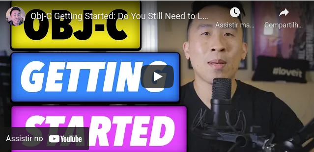

<!--
---
title: 'Programação Mobile: Java e Objective-C, as linguagens nativas dos 📱'
date: Thu, 15 Apr 2021 15:50:35 +0000
draft: false
tags: ['Java', 'Mobile', 'Objective-c', 'Sistemas Operacionais']
---
-->

  

# Programação Mobile: Java e Objective-C, as linguagens nativas dos 📱

A área de desenvolvimento mobile está crescendo, hoje além da próspera área de desenvolvimento de aplicativos também temos a crescente necessidade do desenvolvimento de sites e web apps responsivos - que possam adaptar-se à diferentes tamanhos de telas, seja Desktop, Smartphone ou Tablet. **O que é uma linguagem nativa?** Todo o software foi desenvolvido em uma linguagem de programação, isso também aplica-se à sistemas operacionais. Segundo a ferramenta de _analytics_ do site do diretório cerca de 85% do nosso tráfego vem de navegadores _mobile_, isso indica que muito provavelmente você está lendo esse artigo no seu smarphone seja ele Android ou iOS, originalmente o Android foi escrito em Java e o iOS em Objective-C e por que isso é importante? Isso importa porque isso significa que essas linguagens são as que possuem melhor performance, estabilidade e experiência de usuário em suas respectivas plataformas além de ter o suporte das mesmas.

* * *

Objective-C: A linguagem da Apple
=================================

##### Um pouco de história: do Lisa ao MacOS

Objective-C e a Apple tem uma longa história juntos, mas diferente do que muitos pensam a linguagem que muitos chamam abreviadamente de "ObjC" não foi criada pela empresa. Os primeiros computadores da Apple, Apple II e Apple III (com exceção do Apple I) vinham com um interpretador  da linguagem BASIC licenciado da Microsoft e com características próprias como o famoso sinal "\]" para indicar a linha de comando e a organização do código que era diferente de qualquer outro computador BASIC da época.  O primeiro sistema operacional próprio da Apple - desconsiderando o AppleDOS que foi vendido separadamente por um curto período - veio com os modelos Lisa que vinham com o Lisa OS - um dos primeiros computadores com GUI - e posteriormente com a linha Macintosh que vinham com o sistema operacional MacOS System 1-6 escritos em Apple Pascal. A grande virada para a adoção da linguagem Objective-C na verdade veio de outra empresa: a NeXT, fundada por Steve Jobs no mesmo ano em que foi afastado como CEO da Apple. Jobs havia tirado a ideia de construir uma GUI para o modelo Lisa de dentro da XEROX Parc, porém, além da interface gráfica a XEROX também estava desenvolvendo outros projetos importantes como a linguagem de programação Smalltalk - oficialmente, a primeira linguagem de programação Orientada a Objetos - que possuía muitos conceitos de reaproveitamento de código e era ideal para o desenvolvimento de aplicações modernas (isso muito antes de C++ ou Java sequer serem idealizadas).  Jobs procurou a melhor solução para desenvolver seu novo sistema operacional e encontrou no Objective-C duas vantagens que faziam dessa a linguagem ideal até então para desenvolver o sistema operacional de sua nova empresa: ele tinha a orientação a objetos de Smalltalk - sendo muito próxima dessa linguagem - e a compatibilidade com C que era a linguagem mais popular do ramo de desenvolvimento de sistemas operacionais. A escolha acabou fazendo com que a NeXT posteriormente adquirisse a empresa criadora da linguagem a Stepstone. Um pouco da história do começo da NeXT pode ser vista no vídeo [Steve Jobs brainstorms with the NeXT team 1985](https://www.youtube.com/watch?v=Udi0rk3jZYM) e que vale muito a pena ser visto. A NeXT não só adotou o Objective-C como linguagem oficial do seu Sistema Operacional (o NEXTSTEP) como também escreveu um front-end da linguagem para o compilador GCC do projeto GNU - o que facilitaria muito a adoção e portabilidade da linguagem.  Em 1996, a Apple lança um edital para a aquisição de um novo Sistema Operacional. Ela precisava de um sistema moderno que suprisse as deficiências que o então System 7 possuía em relação à features modernas como suporte à processadores de última geração, programação orientada à objetos, proteção de memória e multitask preemptivo. Houveram dezenas de candidatos, mas eles funilaram em dois finalistas o BeOS - que também era trabalho de um ex-CEO da Apple, Jean-Louis Gassée e que depois originou outra empresa concorrente a Be Incorporated  que vendia computadores com esse sistema que oferecia total compatibilidade com os programas Apple System 7 e anteriores - e o NEXTSTEP que acabou vencendo o edital e sendo adquirido juntamente com a NeXT e as patentes do Objective-C por $429 milhões de doláres, recebendo um rebrand para MacOS nome que tem até hoje, se quiser entender melhor a relação do Sistema da NEXT com o MacOS recomendo [esse vídeo](https://www.youtube.com/watch?v=0sOyuiPtlok) onde é mostrado todos os resquícios do antigo sistema no novo.  Posteriormente, a Apple aproveitou suas décadas de experiência com a linguagem e suas inúmeras bibliotecas em Objective-C para construir o iOS que hoje roda nos iPhones, iPads e AppleTVs tornando Objective-C a linguagem nativa de todos os sistemas da empresa.

##### Vantagens do Objective-C

Objective-C têm muitas particularidades, mas a mais marcante delas certamente é seu "parentesco" com Smalltalk, tendo incorporado muitas idéias da orientação à objetos original (antes da orientação à classes como em C++ e Java) e o que isso significa? Bem, que Objective-C é mais próxima de uma idéia "pura" de orientação a objetos do que C++ ou Java. Além disso a linguagem possui outras vantagens marcantes:

*   Possui performance próxima do C;
*   Capacidade de integrar de forma nativa com APIs, bibliotecas e códigos C;
*   Objective-C++ que oferece integração com código C++;
*   Uso nativo de bibliotecas de componentes MacOS e iOS ;
*   Excelentes ferramentas de desenvolvimento da Apple - xcode, clang...

As desvantagens significativas da linguagem estão em justamente ser uma linguagem de nicho - sendo historicamente usada para desenvolver aplicações desktop/enterprise nativas para MacOS e aplicativos para iOS. Além disso, em 2014 a Apple anunciou uma nova linguagem oficial - concorrente à Objetive-C - Swift, que tem o objetivo de ser mais fácil e produtiva oferecendo compatibilidade total com código em Objective-C e bibliotecas nativas e que apesar de ainda ser menos popular que Objective-C vem ganhando muito mercado de forma rápida.

##### Vantagens em ser um programador Objective-C

Ser um desenvolvedor de aplicativos nativos para Apple é um dos segmentos de carreira considerados mais lucrativos dentro da área de desenvolvimento. Primeiramente isso deve-se as grandes barreiras de entrada desse segmento, sendo necessário o investimento em um computadores, celulares e tablets da Apple para desenvolvimento, teste e publicação, subscrição de contas de desenvolvimento e programas da Apple, além de conhecimentos específicos como requisitos de publicação e funcionamento dos aplicativos para essa plataforma que tornam muito difícil à entrada de novos desenvolvedores e torna os profissionais desse segmento muito valorizados.

##### Show me the code

Bem, apesar da linguagem de fato ser multiplataforma pragmaticamente para programar em Objective-C é necessário ter um computador com MacOS, isso por diversos motivos desde o fato da ferramenta xcode ser exclusiva para esse sistema quanto ser necessário compilar os programas em um sistema MacOS para que possam ser executados no MacOS ou iOS. Além disso, é muito raro encontrar material gratuito em português sobre a linguagem. Abaixo deixo o vídeo em Inglês do canal Lets Build That App ensinando um pouco do básico de Objective-C na prática. 

* * *

Java: A linguagem da Oracle
===========================

##### Um pouco de história: Sun, Oracle, Google, GPL e Android

Em 1990, uma importante empresa no Vale do Sílicio, a Sun Microsystems que tinha como CEO ninguém menos que o lendário [Bill Joy](https://pt.wikipedia.org/wiki/Bill_Joy) tinha o projeto de interligar várias interfaces e fazer diversos dispositivos diferentes trabalharem juntos, incialmente esse projeto estava sendo desenvolvido com C++ pelas produtividade que a Orientação a Objetos com a linguagem oferecia, porém ainda existia o problema de que o código compilado apenas executava na Arquitetura de Hardware para qual foi compilada, necessitando por vezes mudanças ou extensões no código e recompilação para que fosse possível o Software rodar em um novo dispositivo que tivesse uma arquitetura ainda não surpotada. Devido a falta de padronização da época e as incopatibilidades entre diferentes Arquiteturas na época que eram incentivadas devido a concorrência desregulamentada no mercado de hardware dos anos 90 tornava muito problemático suportar todas as arquiteturas na época e justamente essa dificuldade levou o líder do projeto James Gosling a decidir que a equipe criasse a própria linguagem de programação que suportasse os mais diferentes tipos de arquitetura e que mantivesse as características da Orientação a Objectos em C++. Em 1991 a versão inicial dessa linguagem foi batizada de Oak (Carvalho). O projeto conhecido como Star Seven da Sun em questão que gerou a criação do Oak não decolou como o esperado o que levou ao seu cancelamento em 1992. Após o cancelamento, a Linguagem Oak foi arquivada e só voltaria a ter a atenção da empresa em 1994. Isso porque em 1994 surgiu algo que está te possibilitanto conhecer mais sobre a história da linguagem Java: a Internet. Devido ao projeto que originou a necessidade da linguagem trabalhar com a intercomunicação de dispositivos, foi dado uma grande enfase em utilizar os melhores protocolos de comunicação e networking na linguagem, o que tornou a lingugem perfeita para o projeto que a empresa pretendia desenvolver: um navegador. Para a utilização comercial no projeto do navegador que a Sun pretendia desenvolver era necessário que a mesma registrasse a Linguagem Oak como sua patente, mas aí foi encontrada a barreira legal para o registro devido a esse nome já estar registrado, o que levou a linguagem a ser renomeada como Java (e a origem ou motivação desse nome tem diversas lendas por trás desde o café favorito de Gosling até a gíria para café forte). O navegador lançado pela Sun, conhecido como Hot Java permitia interatividade nas páginas HTML utilizando a linguagem Java, o que motivou a Netscape concorrente na época a lançar a linguagem JavaScript (que apenas tem "Java" no nome como Marketing, já que Java era a alternativa mais popular no momento, mesmo que não houvesse relação nenhuma entre ambas). Deste momento então, a Sun focou em utilizar Java como linguagem de interatividade na Web e com dispositivos embarcados, com projetos de Wearables e outros dispositivos que se comunicavam via rede. Devido ao crescimento da linguagem muitos competidores similares desenvolvidos por grandes companhias como o C# da Microsoft começaram a surgir, o que acabou dificultando para Sun manter a popularidade da linguagem e por volta de 2006, linguagens que já eram open source como Ruby e Python começaram a ganhar popularidade exponencial o que fez com que a Sun tomasse um passo que foi visto por muitos como arriscado: tornar sua principal tecnologia - Java - código aberto, sob uma licença de código livre GPL. Porém, a linguagem que já possuia uma forte comunidade e grandes players como clientes apenas ganhou mais força após a abertura do código, fazendo com que a popularidade da tecnologia crescesse ainda mais, elevando o valor de mercado da empresa que ainda mantinha a liderança no desenvolvimento da mesma: a Sun. O que levou a Oracle outra empresa que estava em constante crescimento e que utilizava as tecnologias da Sun a adquiri-la em 2009 por 7,4 bilhões de dólares, incluindo suas patentes que além do Java contavam também com inúmeros softwares como o StarOffice e o sistema operacional OpenSolaris. Porém, nesse momento surgiu uma das maiores polêmicas jurídicas que se arrasta até os dias de hoje e tem afetado e influenciado direta ou indiretamente o mundo da tecnologia. Isso porque por volta de 2003, iniciou-se o desenvolvimento do Sistema Operacional mais utilizado do mundo hoje, o Android, pela Google. Devido a ser um Sistema Operacional que deveria executar em diferentes arquiteturas e que buscava ser popular para o desenvolvimento de aplicativos e extensões, tornou-se claro para a Google que Java seria uma boa escolha para o projeto, o que fez a mesma tentar negociar com a Sun o direito de uso da linguagem Java sem sucesso devido a má experiência que a Sun havia tido com concorrentes como a Microsoft e o temor de que isso levasse a Google a criar um fork da linguagem sem compatibilidade com a versão oficial da linguagem. E aqui começa o problema, como a Google não conseguiu adquirir os direitos de uso da linguagem a mesma decidiu utilizar uma "cópia" aberta (criada através de um processo conhecido como "clean-room", muito famoso pelo caso da Compac e da IBM nos anos 80) conhecida como Harmony do Projeto Apache. Para o Projeto Apache, o Harmony era um projeto central já que muitos das suas bibliotecas e tecnologias eram feitas em Java e a mesma jamais conseguiu a licença de uso da Sun devido a divergências sobre licenciamento de código que a mesma tinha com a Sun. Essa primeira versão do Android, que usava o Harmony no Android SDK ficou conhecida como [Dalvik](https://en.wikipedia.org/wiki/Dalvik_(software)) lançada em 2008 tornando Java a linguagem nativa do Android, porém a implementação Harmony que não era a mesma da Sun e posteriormente da Oracle, apenas em 2016 na versão 7 do Sistema Android é que foi adotado a OpenJDK como oficial do AndroidSDK tornando as implementações da Oracle e do Android mais próximas, utilizando uma implementação aberta da linguagem. Porém, quando a Oracle adquiriu todas as patentes da Sun em sua aquisição a mesma contestou o quão "clean-room" a implementação usada no Android realmente era e acusou a Google de ter feito modificações no mesmo adicionando código que infligia o copyright da Linguagem Java, listando inúmeros trechos de código e APIs que supostamente continham código que infligiam a licença da Linguagem Java tanto no Harmony quanto nas modificações da Google. O processo acabou desrolando em uma série de questionamentos e acusações sobre reimplementações de Software, gerando inúmeras discussões e posicionamentos de empresas e comunidade de software que apoiam um ou outro lado do processo que segue até hoje e que pode redefinir como as patentes e reimplementações (engenharia reversa) são ou não são legais. Em 2021 após 10 anos, essa disputa finalmente chegou ao fim com a vitória da Google na Suprema Corte Americana que avaliou através de ferramentas de auditoria que a quantidade de código que supostamente infringia as patentes da Oracle eram de 0,0004% o que configura fair use, além de colocar como jurisprudência que reimplementar APIs de forma "clean" não violam quaisquer patentes da empresa que detêm os direitos autorais.

##### Vantagens do Java

Muitos devem ter acompanhado nossa série de posts sobre Java moderno e sabem que Java além de ter sido a linguagem mais popular do mundo por décadas ainda hoje possui um vasto mercado não somente no desenvolvimento de aplicativos para smartphone como também no desenvolvimento de software web, desktop e principalmente no que é conhecido como "Mundo Enterprise" (que é o segmento de grandes companhias que precisam de uma linguagem que possua suporte comercial e que possa oferecer soluções empresariais em diversos níveis como Java e C#). Além disso Java tem como linguagem diversas características marcantes:

* Orientação a Objetos como padrão de desenvolvimento da linguagem;
* Portabilidade - Independência de plataforma;
* Recursos de Rede - Possui extensa biblioteca de rotinas que facilitam a cooperação com protocolos TCP/IP, como HTTP e FTP;
* É distribuída com um vasto conjunto de bibliotecas (ou APIs);
* Desalocação de memória automática por processo de garbage collector;
* Inúmeras bibliotecas open-source utilizadas pelos maiores sistemas do mundo;
* Uma das maiores comunidades de tecnologia, com inúmeros programadores e empresas que apoiam;
* Muito material pago e gratuito, em português ou inglês sobre a linguagem;
* Rápida execução, optimização de performance em tempo de execução - JIT;
* Alta segurança (no sentido de o código executar exatamente o que foi previsto);
* Grande número de ferramentas de qualidade para desenvolver na linguagem;
* Possibilidade de desenvolver em qualquer plataforma: embarcados, web, desktop e aplicativos;
* Livre como em "Liberdade de Expressão", apesar das polêmicas implementações como a OpenJDK são gratuitas e livres para uso tal qual qualquer outro software livre e sem gerar qualquer problema jurídico ou restrição de desenvolvimento;

Durante toda essa disputa e discussão entre Google e Oracle levou com que muitas empresas que não utilizavam a versão da Oracle a se preocupar com possíveis processos devido a suas reimplementações da JDK ou JVM, além de colocar o Google em uma posição muito delicada com o Sistema Operacional Android. Isso levou com que o Google fechasse uma parceria com a JetBrains, outra empresa importante do mundo Java para desenvolver uma nova linguagem nativa e oficial para o Android: Kotlin. O objetivo era que Kotlin fosse uma linguagem aberta, totalmente compatível com Java tanto no código, quanto em sua compilação e execução e que mantivesse as características principais da linguagem, porém com features modernas, menos verbosidade e que permitisse usar e se comunicar com todo o código Java de forma funcional e natural na linguagem. Hoje, a linguagem Java continua sendo a linguagem nativa do Android, mas devido ao processo da Oracle e a adoção da linguagem Kotlin como oficial o Android SDK já não recebe mais todas as atualizações que a linguagem Java recebe, sendo impossível utilizar muitas de suas features modernas de forma nativa na Plataforma até o momento, o que pode ser uma grande desvantagem para quem pretende desenvolver aplicativos nativos para Android em Java.

##### Vantagens em ser um programador Java

Apesar de Java estar perdendo espaço como a linguagem de programação mais popular do mundo ela ainda é listada como segunda ou terceira linguagem mais popular tanto pelo índice da IEEE, o Tiobe, RedMonk e o PYPL, o que significa que podemos afirmar com seguridade que ela não somente é uma linguagem muito popular como uma das mais utilizadas pelo mercado em qualquer lugar do mundo, o que é excelente para quem busca oportunidades no mercado de trabalho tanto no Brasil quanto fora do País. Além disso a maior parte dos bancos públicos do Brasil e os Sistemas mantidos pelo Governo são em Java o que abre excelentes oportunidades para quem busca a estabilidade através de concursos públicos.

##### Show me the code

Um grande motivo de discussões sobre o desenvolvimento de aplicativos nativos para Android, seja com Java ou seja com Kotlin é que para isso é necessário utilizar ferramentas como o Android SDK, Android Studio ou Eclipse e emuladores que rodam o SO do Android em virtualização o que não coloca nenhuma barreira de SO como no caso do Obj-C, mas que exige uma máquina mais robusta do que normalmente se utiliza no desenvolvimento de outras aplicações sendo recomendado para uma boa experiência que a máquina possua no mínimo 16GB de RAM, processador i5 ou superior e 2GB de memória de vídeo dedicada o que é algo que se deve levar em consideração antes de começar a programar para Android. Abaixo deixo um vídeo com um tutorial básico sobre como desenvolver um app "Hello World" para Android, para quem se interessar o mesmo canal, "Universidade Código" tem uma série feita em 2019 ensinando a desenvolver aplicativos nativos feitos em Java para o Android:
